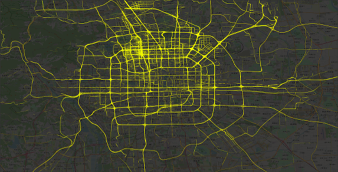

# Microsoft-GeoLife

This repo is a revisit and significant refresh of some work from my M.S. at GMU doing trajectory mining and urban analytics with the Microsoft GeoLife dataset.

The dataset consists of ~25M GPS points across 18,670 PLT/CSV files for 182 anonymized individuals. 

Merging all the data together into a single Polars DataFrame with minimal preprocessing takes approximately 30 seconds with multiprocessing on a 12 core (24 thread) AMD Ryzen 9 3900x with 32GB RAM. 

Dumping the full dataset of points and lines to a GeoPandas GeoDataFrame for exporting Parquet/GeoParquet takes significantly longer, approximately 15 minutes total, with each file being ~1.7-1.8GB each.
This is a process that was done once for testing purposes. Subsequent reprocesing of the data with additional filtering/preprocessing (e.g., temporal resampling, trajectory/trip heuristics, etc.) is significantly
faster, about 1 minute total, as the data is drastically reduced dependending on filters. 

